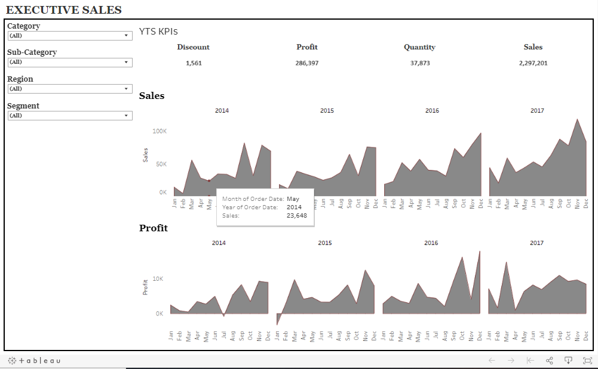

# Tableau Project Overview (Requirement)

### General Requirements:
1. Dashboard size is 1250px wide by 750px tall.
2. Prefer using containers.
3. The dasboard has a total of 5 containers (no more, no less).
4. The filter pane.
5. Each filter has some padding.

### The Charts Pane Requirements:
1. All 3 charts must be in one vertical container.
2. Do proper formatting.
3. Each chart has some padding between them and other objects.
4. Each chart has a grey border, slightly darker than the Pane background color.
5. The Pane under the Title has a border.

### Business Requirements
1. Show four filters- Category, Sub-Category, Region, and Segment. These filters should have only relevant balues.
2. The dashboard should have the title "Executive sales".
3. The first chart should have the title "YTS KPIs" and should show the following-
    * Total Discount
    * Overall Profit
    * Total Quantity and
    * Total Sales
4. The second graph should have the title as "Sales" and should show monthly sales per year. Make sure it is an area chart with proper formatting.
5. The third graph should the title as "Profit" and should show monthly profit per year. Make sure it is an area chart with proper formatting.
6. Do proper formatting so that it can look professional.

### Tableau Project Expected Solution:
After creating the dashboard, we should be getting the dashboard something like below-

[Visit the project and visualization dashboard here.](https://bit.ly/simple_superstore_dashboard "Tableau Superstore Dashboard")

That's all for this project, feel free to suggest to the email below and let me know how can this project make working even better.

### M Adyan Rohutomo | [madyanr@gmail.com](mailto:madyanr@gmail.com)